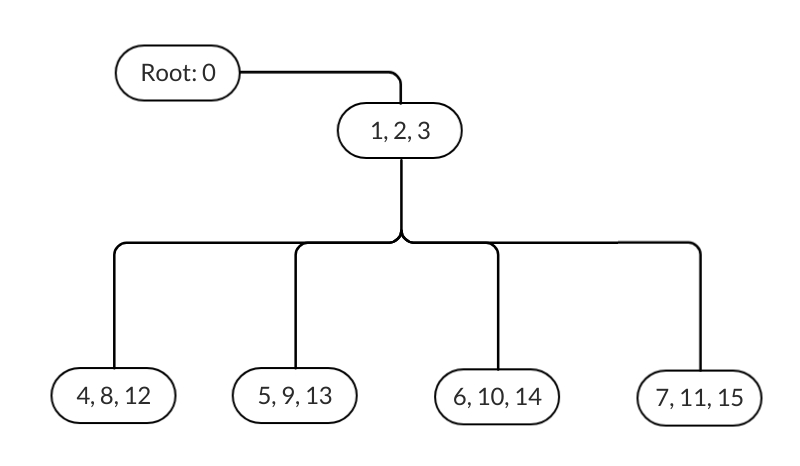
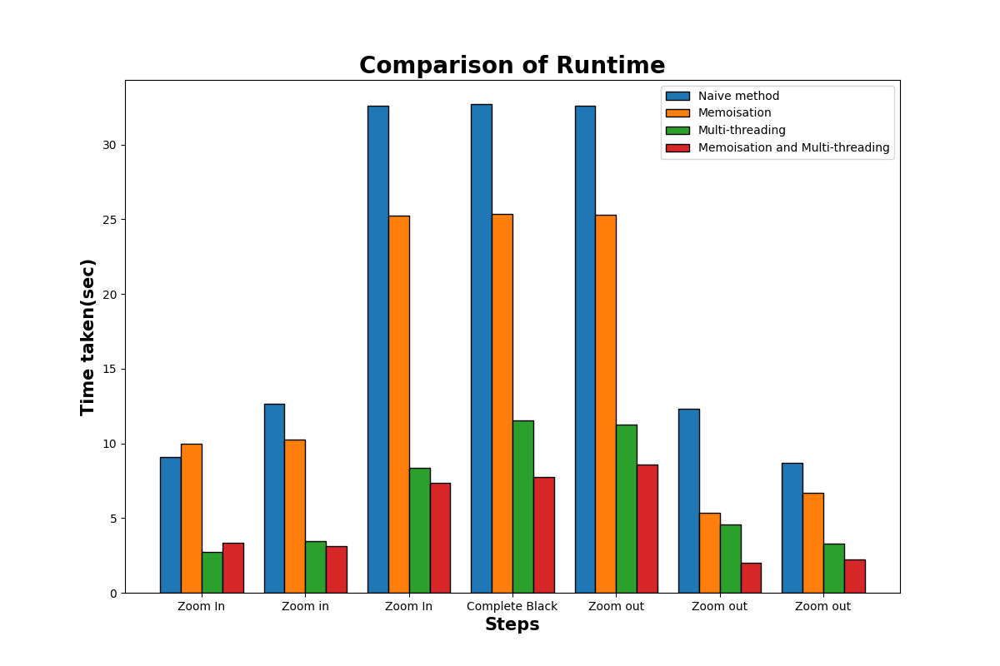

# MandelbrotZoom

## Author: Kadoo Aditya Anil (200050055)

### Goal: Create an interactive animation of zooming into the Mandelbrot set in C++ for the Project of the CS-293 course in Autumn 2021

----

## Description

The app can create a window initialized to show the complete Mandelbrot Set on the complex plain using **SFML graphics library**. The user can right-click on one of the quadrants to zoom into it and left-click anywhere to zoom out. Thus wiht every click, the user can zoom 2x times.

Zooming in can be done upto 20-30 times and the image quality won't get poor but this comes at the expense of more and more computation time. Hence to reduce the time complexity while zooming, memoisation and multithreading is implemented. These algorithms are explained below in detail.

----

## Makefile Commands

- `make compile` - Compiles the all necessary files and generate a obj/main.app executable file
- `make run` - Executes main.app with times being logged into a [log file](test/log_file.txt)
- `make debug` - Starts a debug session in GDB with main program loaded
- `make clean` - Cleans the object directory
- `make plot` - Runs python program and generates the [comparision plot](images/comparison.png)
- `make count` - Counts total number of lines of code

----

## Algorithms and there comparison

1. **Naive method**

    The most basic way to generate the plot of mandelbrot set uses the escape-time algorithm to give every point in the complex plane a value between 0 to MAX_ITER (constant like 500). This value is then used to colour the corresponding pixel on the plot. Thus for every pixel on the window the algorithm runs no more than MAX_ITER iterations. This means the complexity is **O(MAX_ITER\*N)** where N is the number of pixels on the window.

    Although this algorithm is not very slow, as we will be zooming into the Mandelbrot set this algorithm doesn't take that into account and repeats the computations for many pixels which can be optimised.

2. **Memoisation**

    As discussed above, we must find a way to avoid repeating calculations for pixels that are going to reappear on the window after zooming. This can be done by memoising the values returned by the escape-time algorithm and reusing these values after zooming. Here, a simple B-tree comes to rescue!

    | X, Y-> | 0   | 1   | 2   | 3   |
    | ----   | --- | --- | --- | --- |
    | 0 ->   | 0   | 4   | 1   | 5   |
    | 1 ->   | 8   | 12  | 9   | 13  |
    | 2 ->   | 2   | 6   | 3   | 7   |
    | 3 ->   | 10  | 14  | 11  | 15  |

    

    The table given above shows how the values on the window are hashed to keys from 0 to N-1 where N is number of pixels. Using theses keys we store the results for each pixel as entries in a tree as shown in the figure.

    This way zooming into any one of the quadrants means we can reuse that corresponding branch of the tree and delete the rest. This way we only need to perform the escape-time algorithm on exactly 3\*N/4 values. The resulting time complexity is **O(MAX_ITER\*(3N/4))** which is a significant improvement.

3. **Multi-threading**

    Performing the escape-time algorithm for each pixel is an independent task and hence can be done simultaneously by multiple threads. This way, the time complexity is reduced by a factor equal to the number of threads that can be run at a time on any given machine. This decreases the computation time by a lot.

Below, the bar graph shows comparison between computation times for different algorithms while zooming into a completely black region of the Mandelbrot Set and then zooming out back to the start.

For the first case, the memoisation is marginaly slower as it has almost equal computation. But it is clear that in later cases that memoisation takes almost 3/4th amount of time. Multi-threading simply boosts the execution time in both cases.

----

## Headers and Sources

- **Complex** - A class for implementing complex numbers on the complex plane. Data type for real and imaginary components is taken as template argument for flexibility. Supports operators such as +, -, *, /, !, ==, !=, [] and fucntions such as abs().

- **SFML** - External library used for rendering graphics and taking user input. It creates the window and takes mouse-clicks for zooming in and out.

- **Main** - Only a source file which has the actual main function that brings together all the headers to run the application. It creates all the threads and executes the runtime while-loop.

- **Mandelbrot** - Implements a function for the mandelbrot set's [Optimised Escape-Time algorithm](https://en.wikipedia.org/wiki/Plotting_algorithms_for_the_Mandelbrot_set#:~:text=number%20of%20iterations.-,Optimized%20escape%20time%20algorithms,-%5Bedit%5D). It can be extended to include various other fractals!

- **Entry** - Has a class to create entries that go into the tree. These entries have a hashed key and a corresponding value. These can be compared using <=, <, ==, >, <= and != operators to order the entries based on the keys while accessing the tree.

- **Tree** - This has a class for Nodes and a class for Trees that uses the nodes. The nodes have 3 entries and 4 children each. The tree class stores a root pointing towards the root-node and a root_data pointing to the least entry. Although B-tree as always balanced, this version is not but the way it is used in the program guarantees **O(logN)** insertion and access time.

- **Utilities** - A header to encapsulate all the functions and data relevant while the programs runtime. This was made just to keep the main program clean and small.

----

## Problem Statement by Prof. Bhaskaran Raman

### Overall goals, principles

- Do substantial coding (~1500 lines or more), using data structures and algorithms learnt in the course.

- Write a design document first, before starting the implementation.

- Your code should be well commented, properly indented. Function and variable naming should be well done (don’t use context-free names like xyz, badlu1, etc).

- The code must be split across multiple files as necessary.  

Implementation must be in simplecpp. If you want to use any other graphics package, talk to me first

1. There is this really interesting XScreenSaver of galaxies colliding with one another: <https://youtu.be/xBprAm9w-Fo> . Implement some version of this. You are free to design as you please, so long as the overall goals/principles above are achieved. You can include some interactivity to make it more interesting.`  

2. Learn about what the Mandelbrot set is. One of the most beautiful animations is that of Mandelbrot zoom. You can find tons of videos on this in YouTube. The math behind is simple yet captivating. Implement a Mandelbrot zoom. You can add in some interactivity if you like.

3. If there is anything else you want to do, talk to me first.

### Project grading

- Submission deadline will be roughly the end-sem date for CS213. Start working accordingly. Exact date to be decided after end-sem timetable is out.

- Submission and grading will be similar to CS101 project, if you did it. You will have to submit a short video showing your code+demo.

- Evaluation will be based on demo to two different TAs, each of whom will give you marks out of 50. Each TA will give a Yes/No. Instructor will resolve any discrepancies.

----
